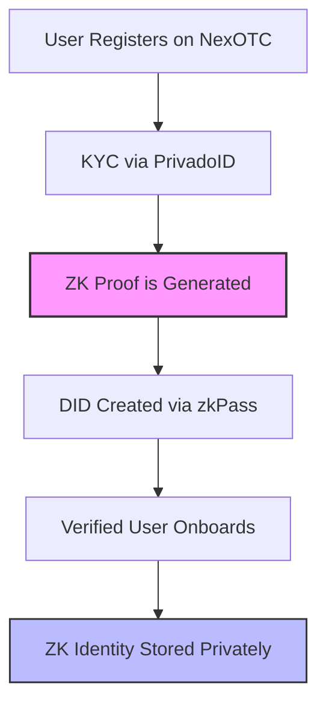

# ZK Identity

!!! note "Zero-Knowledge Identity: Private by Design"
    NexOTC uses **Zero-Knowledge Proofs (ZKPs)** to verify user identity, compliance status, and permissions — all without revealing any personal data. This enables secure and compliant onboarding while preserving full privacy.

---

<h2>🔍 What is a ZK Identity?</h2>

A **ZK Identity** allows users to prove specific attributes (e.g., "KYC Verified", "Institutional Status", or "Within Jurisdiction") without exposing underlying sensitive data. It’s built upon technologies like:

- **zk-SNARKs**: Zero-Knowledge Succinct Non-Interactive Argument of Knowledge  
- **DID** (Decentralized Identifiers): Portable identity representations  
- **Selective Disclosure**: Only disclose what’s necessary for compliance

---

<h2>🧩 How It Works</h2>

---

<h2>🧠 Benefits of ZK Identity</h2>

A **ZK Identity** allows users to prove specific attributes (e.g., "KYC Verified", "Institutional Status", or "Within Jurisdiction") without exposing underlying sensitive data. It’s built upon technologies like:

- ✅ **No PII Exposure**: KYC/KYB info never stored on-chain or shared between users
- 🔐 **Selective Verification**: Only the proof of compliance is shown
- 🌍 **Global Readiness**: Compatible with multiple regulatory frameworks
- 🔁 **Reusable & Portable**: Users can re-use their DID across integrations