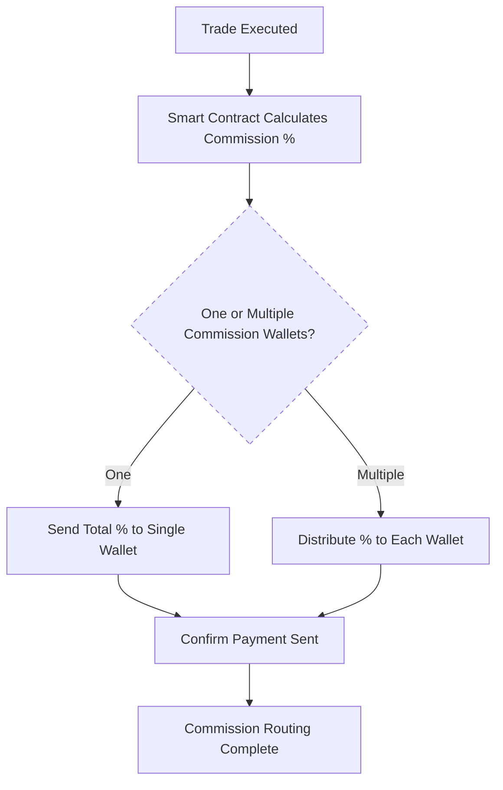
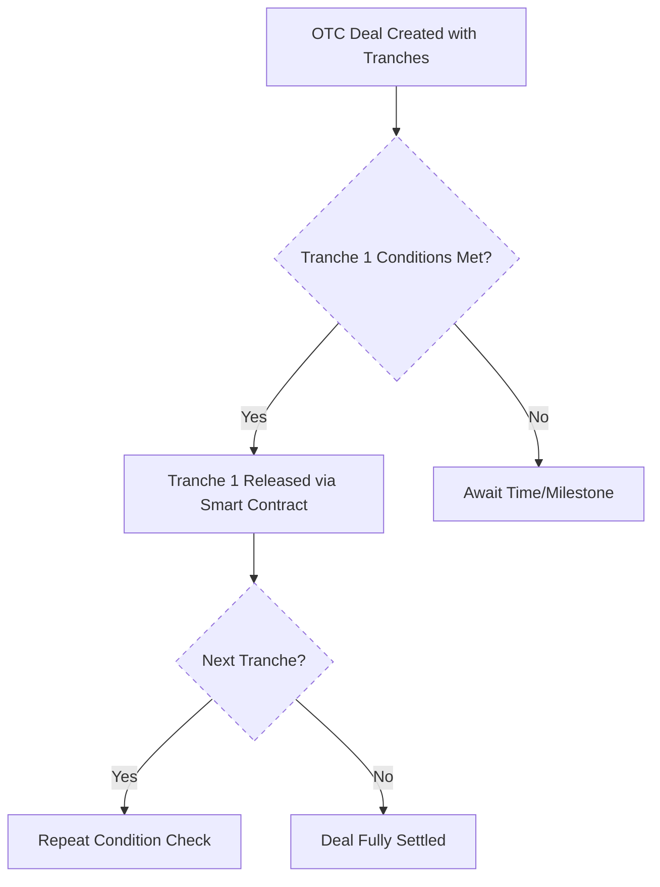

# Fees & Commission Structure

!!! note "Transparent Fees. Flexible Commissions. Automated Routing."
    NexOTC was created to streamline high-value trades, including how fees and commissions are handled, from platform fees to introducer payouts, all embedded directly into the smart contract workflow.

## Platform Fee Model

Our fee system is **tiered by deal size**, offering fair pricing across a wide range of OTC trades:

| Deal Size (USD)         | Platform Fee       |
|-------------------------|--------------------|
| $25K – $500K            | 0.40%              |
| $500K – $5M             | 0.30%              |
| $5M – $50M              | 0.20%              |
| $50M+                   | Custom / VIP       |

1. Fees are deducted directly via the escrow smart contract.  
2. Both parties are notified of the fee structure prior to execution.  
3. Volume-based discounts are available for institutional desks.

## Core Privacy Principles

- Introducer wallets are **not shown to counterparties**
- Percentages are **not visible** to the other side
- Compliance audit shows only total values, with opt-in disclosure

### Commission Routing Logic

NexOTC supports **flexible and private commission routing**, ideal for trades involving introducers, brokers and/or facilitators on either side.

Each party (buyer and seller) can:

- Define up to **3 introducer wallet addresses**
- Assign a custom percentage per wallet (total must not exceed 5%)
- Have these fees routed **automatically** by the escrow smart contract

## Tranche-Based Settlement Logic

For large deals or milestone-based trades, NexOTC supports tranche execution.

### Test

- Each party agrees on number of tranches (e.g. 3x $5M)
- Each tranche can be gated by time or manual milestone
- Smart contract enforces execution flow and compliance lock

