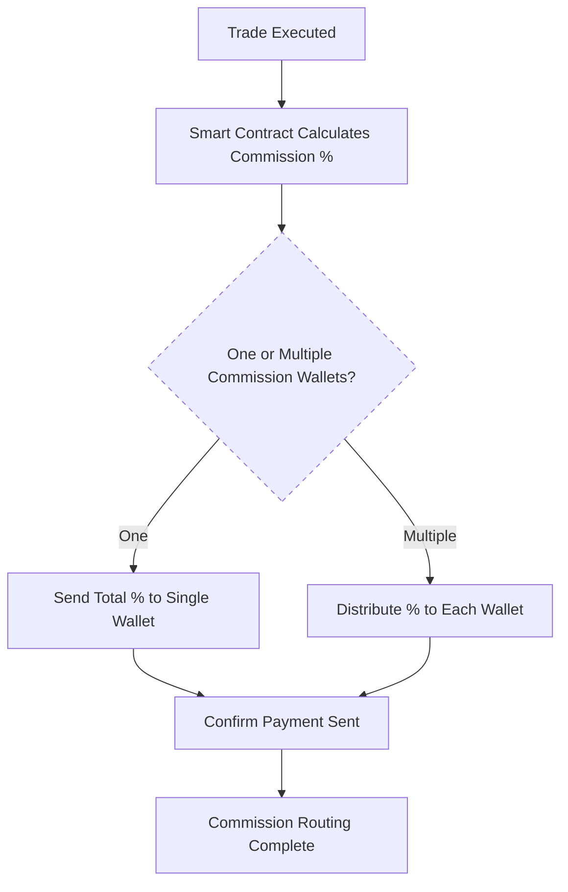

# Fees & Commission Structure

!!! note "Transparent Fees. Flexible Commissions. Automated Routing."
    NexOTC simplifies high-value OTC trading, including how fees and commissions are handled. From platform charges to introducer payouts, everything is automated through the smart contract, with full privacy built in.

## Platform Fee Model

Our fees are based on deal size, offering fair pricing across a wide range of trades:

| Deal Size (USD)         | Platform Fee       |
|-------------------------|--------------------|
| $25K – $500K            | 0.40%              |
| $500K – $5M             | 0.30%              |
| $5M – $50M              | 0.20%              |
| $50M+                   | Custom / VIP       |

1. Fees are deducted directly via the escrow smart contract;
2. Both parties are notified of the fee structure prior to execution;
3. Volume-based discounts are available for institutional desks.

## Commission Routing Logic

NexOTC supports **flexible and private commission routing**, ideal for trades involving introducers, brokers and/or facilitators on either side.

Each party (buyer and seller) can:

- Up to **3 introducer wallets** per party;
- Custom percentage per wallet (**total capped at 5%**);
- Funds are split and routed on-chain with no manual steps.

