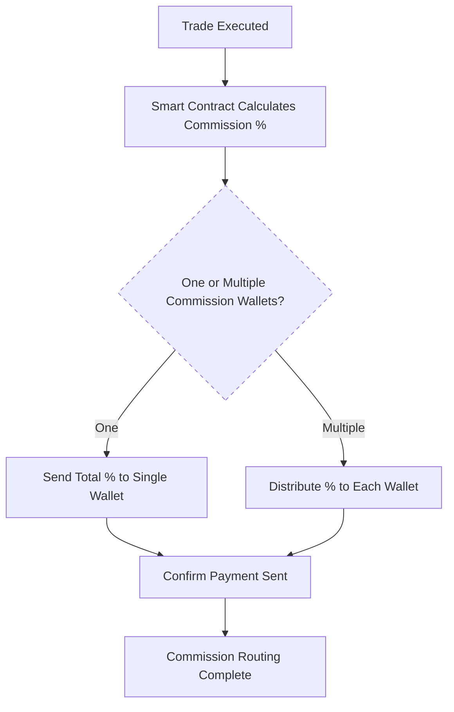

# Fees & Commission Structure

!!! note "Transparent Fees. Flexible Commissions. Automated Routing."
    NexOTC handles fees and commissions with full automation and privacy. Platform fees, introducer payouts and custom splits are processed through smart contracts.

## Platform Fee Model

Our fees are based on deal size, offering fair pricing across a wide range of trades:

| Deal Size (USD)         | Platform Fee       |
|-------------------------|--------------------|
| $25K – $500K            | 0.40%              |
| $500K – $5M             | 0.30%              |
| $5M – $50M              | 0.20%              |
| $50M+                   | Custom / VIP       |

1. Fees are deducted directly via the escrow smart contract;
2. Both parties are notified of the fee structure prior to execution;
3. Volume-based discounts are available for Institutional Desks or VIPs.

## Commission Routing Logic

NexOTC supports **flexible and private commission routing**, ideal for trades involving introducers, brokers and/or facilitators on either side.

Each party (buyer and seller) can:

- Up to **3 introducer wallets** per party;
- Custom percentage per wallet (**max 5% per counterparty**);
- Funds are split and routed on-chain with no manual steps.

> 🛠️ NexOTC retains 5% of the assigned commission amount to cover routing, infrastructure and compliance (reporting). This deduction happens automatically and does not require user input.

