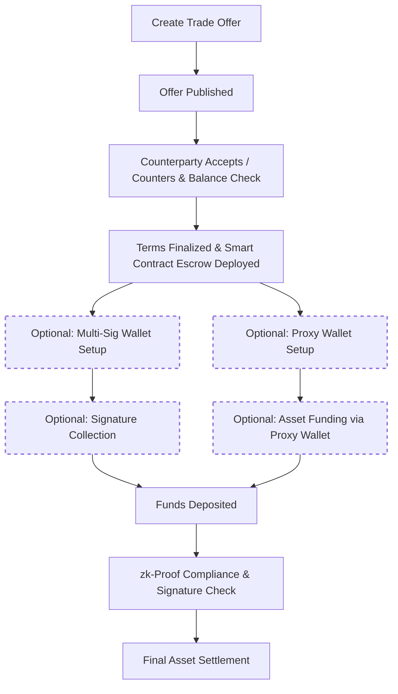

# OTC Trade Workflow

!!! info "End-to-end, Trustless Trade Lifecycle"
    Every OTC transaction on NexOTC follows a customizable workflow with compliance, privacy and escrow protection from negotiation to settlement.

## Overview of Workflow Phases

| Phase                          | Description                                                                                                                     |
|--------------------------------|---------------------------------------------------------------------------------------------------------------------------------|
| **1. Matchmaking / Invitation**| AI Agents identify the best counterparty based on trade preferences or use a private invite link.                               |
| **2. Terms Agreement**         | Discount, tranche settings, commission split, and settlement rules are finalized via user interface.                            |
| **3. KYC/AML Validation**      | Zero-knowledge identity checks confirm each party’s compliance, without revealing sensitive info.                               |
| **4. Escrow Deployment**       | A custom smart contract is deployed, locking in the asset types, deal size, tranches and timers.                                |
| **5. Signature Collection**    | Both parties sign to confirm terms. Multi-Sig support is available.                                                             |
| **6. Asset Transfer**          | Assets are exchanged securely via the escrow contract and routed to the right wallets (including proxy wallets if enabled).     |
| **7. Post-Trade Compliance**   | A zk-proof audit trail is generated for regulatory or internal reporting, with selective disclosure as needed.                  |

## OTC Trade Execution Flow

