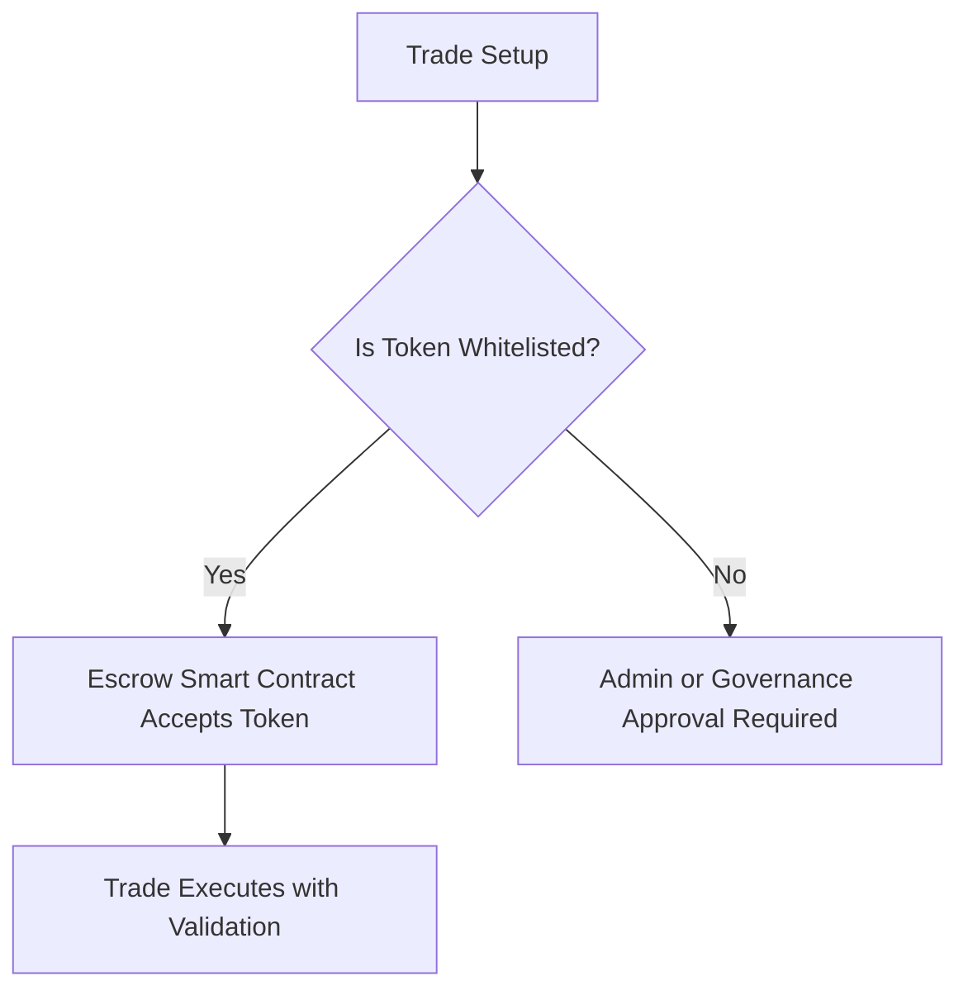

# Asset & Token Support

!!! note "Flexible asset support with secure validation"
    NexOTC supports a wide range of digital assets — including crypto tokens and tokenized real-world assets — all secured via smart contract validation and trade verification layers.

---

<h2>✅ What’s Supported?</h2>

| Category              | Description                                                                 |
|-----------------------|-----------------------------------------------------------------------------|
| **Crypto Tokens**     | Native support for ERC-20, ERC-721, and ERC-1155 tokens on zkEVM & EVMs.   |
| **Tokenized Assets**  | Support for tokenized commodities, securities, and other RWAs.             |
| **Stablecoins**       | USDT, USDC, DAI, and other major stablecoins for fiat-equivalent trades.   |
| **Custom Tokens**     | OTC Desks may whitelist assets via governance or institutional onboarding. |

---

<h2>🌐 Cross-Chain Ready (Future Phase)</h2>

NexOTC is architected with **cross-chain extensibility** in mind. Future versions will include:

- Cross-chain OTC trades (via bridges or native protocols)
- Verified assets using trusted oracle feeds
- Escrow contract compatibility for multi-chain swaps

---

<h2>🔐 Asset Verification Workflow</h2>

