# Asset & Token Support

!!! note "Trade Any Token With Confidence"
    NexOTC supports a wide range of digital assets, including major crypto tokens with future support planned for tokenized real-world assets, all validated through smart contracts.

## Supported Assets

| Asset Type            | Description                                                                                      |
|-----------------------|--------------------------------------------------------------------------------------------------|
| **Crypto Tokens**     | Native support for ERC-20, ERC-721 and ERC-1155 tokens on zkEVM & EVMs.                          |
| **Tokenized Assets**  | Support for tokenized commodities, securities and other RWAs.                                    |
| **Stablecoins**       | USDT, USDC, DAI, and other widely accepted FIAT-pegged tokens.                                   |
| **Custom Tokens**     | OTC Desks can request approval to trade custom or niche assets through governance or onboarding. |

## Chain Support Strategy

NexOTC operates within the Ethereum ecosystem with full support for Ethereum Layer 1 and zkEVM-based Layer 2 networks.

We focus on chains where high-value OTC activity is already well-established, providing strong liquidity, regulatory alignment and interoperability with wallets and compliance tools.

### Supported Environments
- Ethereum Mainnet
- zkEVM Networks (e.g. Polygon zkEVM, Linea)

!!! tip "What is zkEVM?"
    zkEVM is a Layer 2 scaling solution that works directly on top of Ethereum. It uses zero-knowledge proofs to reduce gas fees and improve privacy while staying fully compatible with Ethereum smart contracts, tokens and wallets.

    NexOTC runs on zkEVM, meaning you’re still using Ethereum... just faster, cheaper and more secure.

💡 **Note:** Cross-chain support is not part of the initial roadmap. It may be explored later depending on market demand and security standards. For now, we’re focused on optimizing the Ethereum-native OTC experience.

## Asset Whitelisting

Only approved tokens can be traded on NexOTC. This keeps the platform safe and compliant when dealing with large or unfamiliar assets.

```mermaid
flowchart TB

  %% Top-Level Requests
  A1[Institution / OTC Desk Request]
  A2[Governance Proposal]

  %% Review Processes
  A1 --> B1[Compliance Review]
  A2 --> B2[Community Voting Process]

  %% Decision Nodes
  B1 --> C1{Approved?}
  B2 --> C2{Passed Vote?}

  %% Compliance Outcomes
  C1 -- Yes --> D1[✅ Token Whitelisted]
  C1 -- No --> E1[❌ Rejected]

  %% Governance Outcomes
  C2 -- Yes --> D2[✅ Token Whitelisted]
  C2 -- No --> E2[❌ Rejected]

  %% Final Token List
  D1 --> F[📄 Token Appears in OTC Asset List]
  D2 --> F

  %% Styles
  style C1 stroke-width:2px,stroke-dasharray: 5 5;
  style C2 stroke-width:2px,stroke-dasharray: 5 5;
```

Tokens are either:

- Pre-approved by the platform (common assets like ETH, USDT, etc.)
- Whitelisted by Institutions or OTC Desks
- Reviewed by governance for custom requests (proposals)