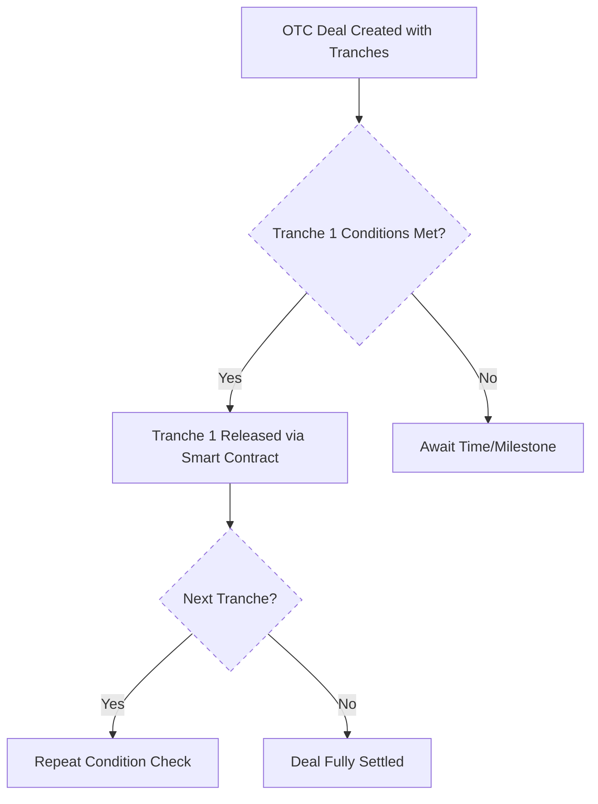

# Tranche & Milestone Settlement

!!! info "Flexible Settlement with Built-in Risk Control"
    Not every OTC trade needs to settle all at once. NexOTC supports flexible execution using tranches with optional milestone triggers for better control and reduced exposure.

## What is a Tranche?

Instead of sending the full amount in one go, a trade can be **broken into multiple tranches** (smaller parts released over time or when certain conditions are met). 

This gives both sides peace of mind in large or complex deals. Funds are only released as the trade progresses, making it easier to manage liquidity and counterparty risk.

## Tranche-Based Settlement

For large deals that are broken into tranches, commissions are released in sync with each tranche.

- The number of tranches and payout timing is **agreed upfront**;
- Each commission is only sent when its tranche settles;
- This keeps incentives aligned and fully automated.

## Milestone-Based Settlement

You can add **custom conditions** to each tranche such as:

- A specific date or countdown timer
- A required signature or approval[^1]
- An external trigger or API event[^2]

These are optional. If no milestones are defined, tranches can settle based on time or manual approval alone.

[^1]: 
     This means someone (like a legal team, DAO signer or internal stakeholder) must sign or confirm before a tranche is released.
     It's useful for high-value deals where oversight or step-by-step confirmation is required.

[^2]:
     This refers to a condition coming from outside the blockchain like a fiat payment confirmation, asset delivery proof or market price feed.  
     These conditions are handled via Oracles or APIs to make sure everything stays in sync with real-world actions.