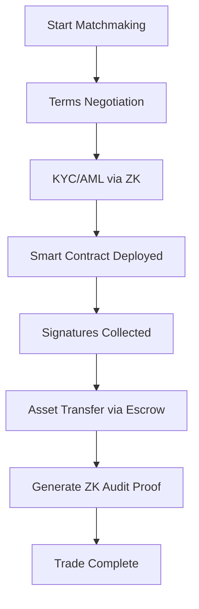

# OTC Trade Workflow

!!! info "End-to-end, trustless trade lifecycle"
    Every OTC transaction on NexOTC follows a programmable workflow with embedded compliance, privacy, and escrow protection from negotiation to settlement.

---

<h2>🔁 Overview of Workflow Phases</h2>

| Phase                    | Description                                                                 |
|--------------------------|-----------------------------------------------------------------------------|
| **1. Matchmaking**       | AI Agents identify suitable counterparties based on trade preferences.     |
| **2. Terms Agreement**   | Discount, volume, tranche logic, and commission setup agreed via UI.       |
| **3. KYC/AML Validation**| ZK-powered checks validate identity & jurisdiction — without exposure.     |
| **4. Escrow Deployment** | Smart contract deployed with custom logic (assets, tranches, timers).      |
| **5. Signature Collection** | Both parties co-sign the final transaction and terms.                  |
| **6. Asset Transfer**    | Assets are exchanged via the smart contract and routed to final wallets.   |
| **7. Post-Trade Compliance** | ZK-proof + audit trail is generated for reporting.                  |

---

<h2>🔄 Diagram: OTC Transaction Lifecycle</h2>

