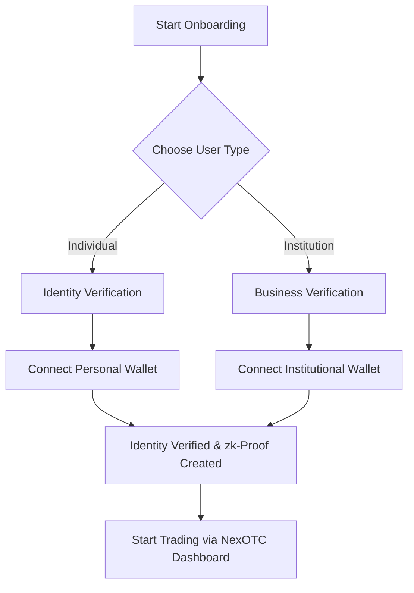

# Getting Started

!!! tip "Start your NexOTC journey!"
    Whether you're trading as an individual or representing an institution, here’s how to get onboarded and start exploring NexOTC.

<h2>Access Requirements</h2>
- 🔐 Non-Custodial Wallet (e.g. MetaMask)
- 🪪 Verified Identity (KYC/KYB with ZK-Compliance)
- 💸 Minimum Deal Size: $25,000
- ✉️ Invitation or Waitlist Access (Initial Launch)

<h2>Onboarding</h2>

