# Getting Started

!!! tip "Start your NexOTC Journey!"
    Whether you're trading as an individual or representing an institution, here’s how to get onboarded and start exploring NexOTC.

## Access Requirements
- 🔐 Non-Custodial Wallet (e.g. MetaMask)
- 🪪 Complete Onboarding[^1] via Private KYC / KYB[^2]
- 💰 Minimum Deal Size: $25,000
- ✉️ Invitation or Waitlist Access (Initial Launch)

## Onboarding

NexOTC requires a one-time onboarding process that ensures all traders meet global compliance standards, without exposing any personal or business sensitive data.

```mermaid
flowchart TD
  A[🔐 Wallet Connect] --> B[🪪 Complete Private KYC / KYB]
  B --> C[✅ zk-SNARK Proof Generated]
  C --> D{🛂 AML Risk Screening}
  D -- Passed --> F[🧾 DID + VC Issued]
  D -- Flagged --> G[🔍 Manual Review]

  style D stroke-width:2px,stroke-dasharray: 5 5;
```

💡 Once completed, users can execute trades instantly and fully compliant without having to re-verify again.

[^1]: 
    Onboarding is proceeded using zero-knowledge proofs which means your identity is confirmed without ever exposing your private data. After completing verification through a secure provider, you're issued a Decentralized Identifier (DID) and a Verifiable Credential (VC) (Example: Getting a digital passport that proves who you are without sharing sensitive info).

[^2]:
    After completing KYC / KYB, a zk-SNARK proof is then generated. Think of it like a cryptographic stamp that proves your identity has been verified, without revealing any personal details. This proof can be used across NexOTC to show you're a trusted party, whether you're trading once or a hundred times.