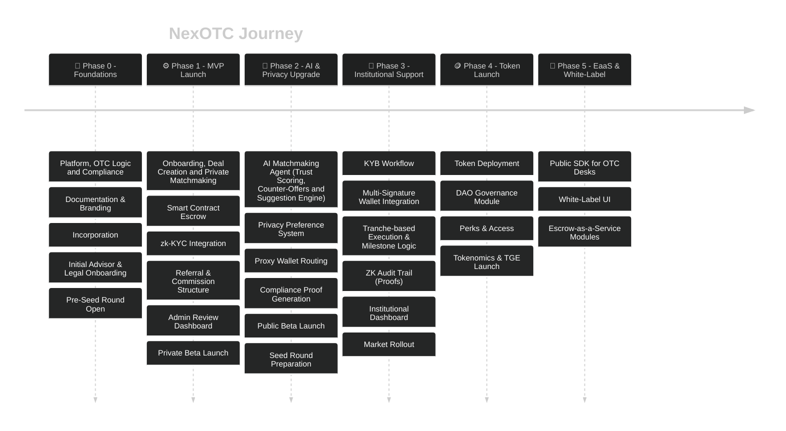

---
hide:
  - toc
---

# Roadmap

Stay informed on the progress of NexOTC. Here's a breakdown of each development phase.

```mermaid
   %%{init: { 'logLevel': 'debug', 'theme': 'dark', 'timeline': {'disableMulticolor': true}}}%%
    timeline
        title NexOTC Journey
          🚀 Phase 0 - Foundations : Platform, OTC Logic and Compliance : Documentation & Branding : Incorporation : Initial Advisor & Legal Onboarding : Pre-Seed Round Open
          ⚙️ Phase 1 - MVP Launch : Onboarding, Deal Creation and Private Matchmaking : Smart Contract Escrow : zk-KYC Integration : Referral & Commission Structure : Admin Review Dashboard : Private Beta Launch
          🧠 Phase 2 - AI & Privacy Upgrade : AI Matchmaking Agent (Trust Scoring, Counter-Offers and Suggestion Engine) : Privacy Preference System : Proxy Wallet Routing : Compliance Proof Generation : Public Beta Launch : Seed Round Preparation
          🏦 Phase 3 - Institutional Support : KYB Workflow : Multi-Signature Wallet Integration : Tranche-based Execution & Milestone Logic : ZK Audit Trail (Proofs) : Institutional Dashboard : Market Rollout
          🪙 Phase 4 - Token Launch : Token Deployment : DAO Governance Module : Perks & Access : Tokenomics & TGE Launch
          💼 Phase 5 - EaaS & White-Label : Public SDK for OTC Desks : White-Label UI : Escrow-as-a-Service Modules
```